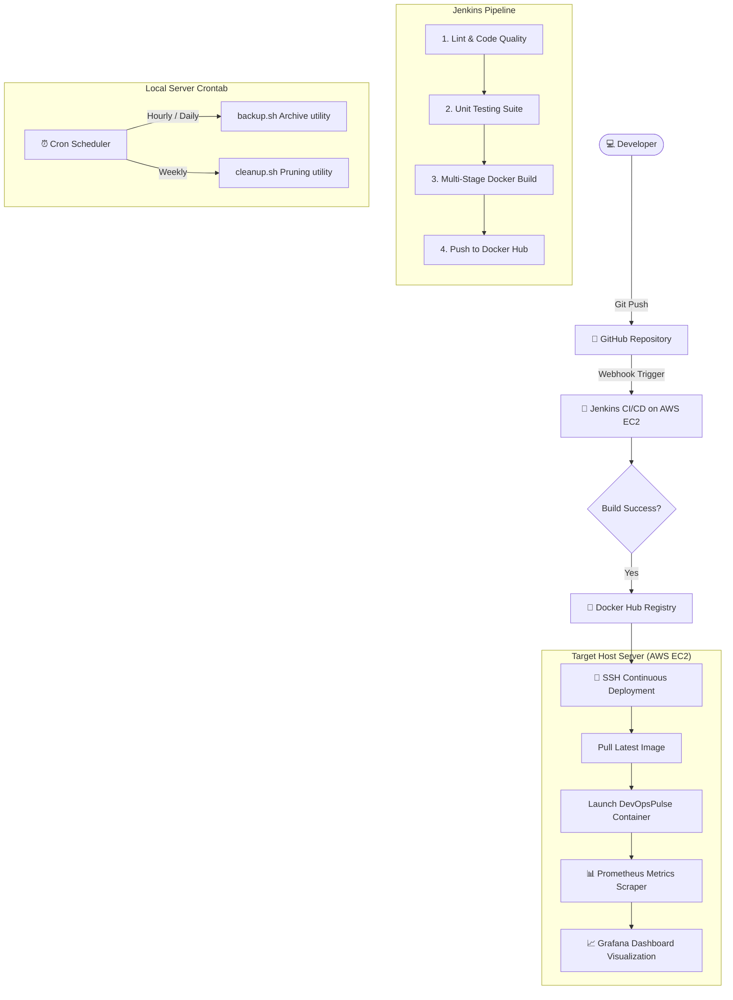

# 📊 DevOpsPulse: Production-Grade End-to-End DevOps Telemetry System

<div align="center">

[](https://opensource.org/licenses/MIT)
[](https://nodejs.org/)
[](https://www.docker.com/)
[](https://aws.amazon.com/)
[](https://www.jenkins.io/)

<p align="center">
  <strong>A high-performance system telemetry dashboard, automated bash engine, and secure CI/CD continuous delivery lifecycle.</strong>
</p>

<p align="center">
  <a href="http://54.92.189.120:3005/" target="_blank">
    
  </a>
</p>

</div>

---

## 🚀 Architectural Paradigm

This repository demonstrates a production-grade continuous integration and continuous deployment (CI/CD) GitOps workflow. The automated loop is triggered upon developer commit, executing unit tests, compiling secure multi-stage Docker images, pushing them to remote registries, and executing continuous delivery to AWS cloud nodes via secure SSH tunnels.



---

## 🛠️ Technology Stack & Ecosystem

| Technology Layer | Tool / Service | Purpose & Implementation Details |
| :--- | :--- | :--- |
| **Version Control** | **Git & GitHub** | Distributed source tracking, pull request code reviews, and webhook events. |
| **CI/CD Automation** | **Jenkins Engine** | Handles pipeline orchestration, test execution, container builds, and deployment. |
| **Application Framework** | **Node.js + Express.js** | Core telemetry service exposing REST endpoints and client dashboard interface. |
| **Containerization** | **Docker & Docker Hub** | Uniform environments using an optimized multi-stage build running on Alpine Linux. |
| **Cloud Infrastructure** | **AWS EC2 (Ubuntu)** | High-availability hosting using Security Groups, elastic IPs, and SSH key pairs. |
| **Monitoring Scraper** | **Prometheus** | Pulls CPU, Memory, Disk, and custom application metrics every 5 seconds. |
| **Data Visualization** | **Grafana Core** | Renders dynamic system metrics using customized glassmorphic dials and line graphs. |
| **OS Scripting** | **POSIX Bash Shell** | Handles compressed backups and automated system log rotation via crontab schedules. |

---

## 📁 Repository Directory Structure

```text
DevOps-Capstone-Project/
├── app/                          # Telemetry Dashboard Node.js Web Application
│   ├── public/                   # Client-side Web UI Assets
│   │   ├── css/style.css         # Glassmorphic, dark-mode styling system
│   │   ├── js/dashboard.js       # Real-time Chart.js polling & socket actions
│   │   └── index.html            # Main dashboard HTML template
│   └── src/server.js             # Express.js server & shell automation API
├── docker/                       # Container Orchestration Configurations
│   ├── docker-compose.yml        # Orchestration manifest for the complete stack
│   └── prometheus.yml            # Prometheus targets & polling scrape config
├── scripts/                      # Automated POSIX Bash Script Utilities
│   ├── backup.sh                 # Compresses configurations/logs into tar.gz backups
│   └── cleanup.sh                # Sweeps system logs older than 7 days
├── Dockerfile                    # Production multi-stage compilation manifest
├── .dockerignore                 # Excludes development caches and local packages
├── .gitignore                    # Prevents credentials, PDFs, and binary assets from pushing
└── Jenkinsfile                   # Enterprise declarative continuous delivery pipeline
```

---

## 💻 Local Launch & Setup Instructions

Ensure you have [Node.js (v18+)](https://nodejs.org/) and [Docker Desktop](https://www.docker.com/) installed on your local environment.

### 1. Standalone Application Setup (Local UI Development)
To run the telemetry server locally outside a container sandbox:
```bash
# Navigate to application workspace
cd app

# Install production dependencies
npm install

# Launch backend telemetry server
npm start
```
* Access the interface locally at: **[http://localhost:3000](http://localhost:3000)**

### 2. Multi-Container Orchestrated Deployment (Docker Compose)
To orchestrate the complete stack (Application + Prometheus + Grafana + Node-Exporter) simultaneously:
```bash
# Navigate to Docker orchestration folder
cd docker

# Compile images and run containers in background
docker-compose up -d --build
```
This command mounts and initiates the following local endpoints:
* **💻 DevOpsPulse Application UI:** [http://localhost:3005](http://localhost:3005)
* **📊 Prometheus Console Scraper:** [http://localhost:9095](http://localhost:9095)
* **📈 Grafana Dashboard Visualization:** [http://localhost:3015](http://localhost:3015) *(Default Credentials: `admin` / `admin`)*
* **⚙️ Node Exporter Raw Metrics:** [http://localhost:9105/metrics](http://localhost:9105/metrics)

---

### ☁️ AWS Live Production Endpoints
For live evaluation on our active AWS EC2 hosting node:
* **💻 Live Production Dashboard UI:** **[http://54.92.189.120:3005](http://54.92.189.120:3005)**

---

## ⚙️ Cron Schedule Script Automations

This project implements automated infrastructure maintenance using lightweight POSIX-compliant shell scripts managed via the system's `crontab` engine.

1. **`scripts/backup.sh`**: Creates compressed tarball backups (`.tar.gz`) of active logs/configs and enforces a 5-day retention policy.
2. **`scripts/cleanup.sh`**: Automatically scans and prunes logs older than 7 days to optimize hosting disk space.

### Cron Installation Setup
To activate these automated triggers on your hosting machine:
```bash
# Open crontab configurations
crontab -e
```
Append the following configuration lines to run backups daily at midnight and log sweeps every Sunday at 2:00 AM:
```cron
# Execute daily configuration/log backup
0 0 * * * /bin/bash /usr/src/app/scripts/backup.sh >> /var/log/devopspulse/backup_cron.log 2>&1

# Execute weekly historical log sweep
0 2 * * 0 /bin/bash /usr/src/app/scripts/cleanup.sh >> /var/log/devopspulse/cleanup_cron.log 2>&1
```

---

## 🛡️ Production Security & Optimizations

This codebase implements several industry-standard enterprise security practices:
* **Multi-Stage Docker Builds:** Standard compilation layers are strictly isolated. The application dependencies are resolved in the first layer (`builder`), transferring only minified, production-only assets to a minimalist Alpine runtime layer (`runner`).
* **Non-Root Privileges:** The final container execution drops all root/admin privileges, running under a securely generated, unprivileged `nodejs` user.
* **Credentials Isolation:** The CI/CD pipeline leverages secure Jenkins secrets management (`withCredentials`), protecting registry logins and AWS deployment SSH keys from leaking into code logs.
* **Resilient Script Fallbacks:** Telemetry scripting interfaces feature smart runtime discovery. If executed on development workstations lacking bash shells, it automatically redirects console feeds to a simulated sandbox interface, keeping dashboards fully interactive and safe.

---

*Developed as a premier DevOps Capstone Project showcasing cloud infrastructure, automation, and continuous delivery.*
